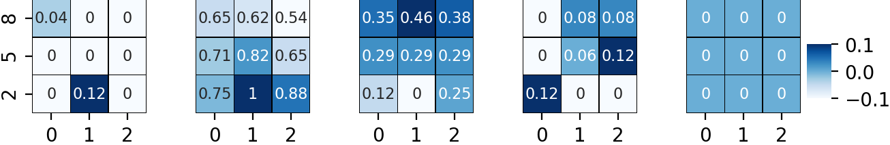
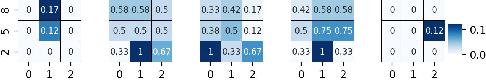
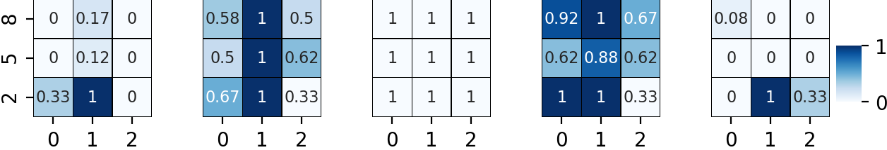

# M_PL_041

# [I]: Line Plots

Left to Right:
* Random Perturbation
* Generalist Preferred Perturbation
* Specialist Preferred Perturbation

Top to Bottom:
* 30% Perturbed, only one axis
* 30% Perturbed, both axes
* 60% Perturbed, only one axis
* 60% Perturbed, both axes
* 90% Perturbed, only one axis
* 90% Perturbed, both axes

### Average Abundance [Plants]

### Average Resilience [Plants]

### Average Persistence [Plants]

### Variability in Abundance [Plants]

### Variability in Resilience [Plants]

### Variability in Persistence [Plants]

### Average Abundance [Pollinators]

### Average Resilience [Pollinators]

### Average Persistence [Pollinators]

### Variability in Abundance [Pollinators]

### Variability in Resilience [Pollinators]

### Variability in Persistence [Pollinators]

                 

# [II]: Heatmaps

Left to right:
* System Driven Restoration
* Degree Driven Restoration
* Closeness Driven Restoration
* Betweenness Driven Restoration

Along x-axis:
* Random Perturbation (0)
* Generalist Preferred Perturbation (1)
* Specialist Preferred Perturbation (2)

Along y-axis:
* 30% Perturbed
* 60% Perturbed
* 90% Perturbed

### Average Abundance [Plants]

### Average Resilience [Plants]

### Average Persistence [Plants]

### Variability in Abundance [Plants]

### Variability in Resilience [Plants]

### Variability in Persistence [Plants]

### Average Abundance [Pollinators]

### Average Resilience [Pollinators]

### Average Persistence [Pollinators]

### Variability in Abundance [Pollinators]

### Variability in Resilience [Pollinators]

### Variability in Persistence [Pollinators]

                 
                 

# [III]: Scoring Approaches

### Average Abundance [Plants]

### Average Resilience [Plants]

### Average Persistence [Plants]

### Variability in Abundance [Plants]

### Variability in Resilience [Plants]

### Variability in Persistence [Plants]

### Average Abundance [Pollinators]

### Average Resilience [Pollinators]

### Average Persistence [Pollinators]

### Variability in Abundance [Pollinators]

### Variability in Resilience [Pollinators]

### Variability in Persistence [Pollinators]

                 
                 
                 
